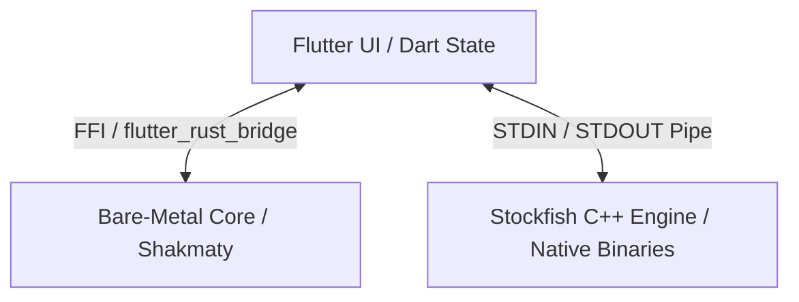

# IdeaSpace Chess Academy — Canonical Technical & Product Specifications

IdeaSpace Chess Academy (ICA) is a state-of-the-art chess learning and simulation platform. It bridges human intuition with algorithmic calculation by integrating high-performance native engines, bare-metal state verification, adaptive AI tutoring, and deep psychological diagnostic algorithms.

---

## 1. App Overview & Vision
IdeaSpace Chess Academy is designed for chess enthusiasts who want to transition from rote move calculation to deep positional sight. Unlike traditional chess apps that focus on playing against static engines, ICA is built on the philosophy of **adaptive training**:
- **Cognitive Visualization**: Visual feedback is used to reinforce spatial board awareness and combat cognitive blind spots (scotomas).
- **Simulated Human Styles**: A roster of 20 distinct AI personas simulates real-world human chess playstyles (aggressive, defensive, trap-oriented, positional).
- **Mentor AI Integration**: GM Chanakya, a dedicated virtual chess mentor, acts as an adaptive coach, analyzing mistakes and guiding the student's curriculum in real time.

---

## 2. Full App Map & Navigation
The application features a sidebar-based navigation structure with 12 distinct pages/modes:

| Index | Mode / Page | Sidebar Path | Purpose |
|---|---|---|---|
| 1 | **Home** | `Home` | Master dashboard displaying live stats, active daily challenges, rating progress, and the overall cognitive radar chart. |
| 2 | **Assignment** | `Assignment` | Curated daily tasks served by GM Chanakya to provide structured daily practice. |
| 3 | **Arena** | `Arena` | Rated competitive matchmaking system against 20 custom AI personas with varying ELO ratings, styles, and time controls. |
| 4 | **Battleground** | `Battleground` | A free-play sandbox mode against the raw Stockfish engine with a live evaluation bar, side switching, and on-demand commentary. |
| 5 | **Academy** | `Academy` | Active training lobby where GM Chanakya plays against the student, adaptively targeting their specific cognitive weaknesses. |
| 6 | **Puzzles** | `Puzzles` | Thematic tactical chess puzzles served dynamically based on diagnosed scotomas (blind spots). |
| 7 | **Analysis** | `Analysis` | Study Lab containing a free board for PGN loading, move exploration, custom position setup, and manual move trees. |
| 8 | **Archive** | `Archive` | Historical records of all rated and Academy games, featuring move-by-move replay capability in cinema mode. |
| 9 | **Tutorial** | `Tutorial` | Interactive step-by-step curriculum modules explaining tactical themes, chess openings, endgames, and middle-game strategy. |
| 10 | **Settings** | `Settings` | Centralized preferences panel for sound/music, piece sets, board theme selection, engine thread configuration, and move times. |
| 11 | **Store** | `Store` | Visual catalog for unlocking premium chessboard themes, sound packs, and visual assets. |
| 12 | **About Us** | `About Us` | A high-fidelity animated ebook presenting the app's mission, manual, technical stack details, and support links. |

---

## 3. GM Chanakya: The Chess Mentor AI
GM Chanakya is a highly optimized, custom AI mentor persona who lives in three primary areas:
1. **Tutorial**: Guides the student through curriculum lessons with text and visual arrows.
2. **Academy**: Plays against the user using an adaptive engine that exploits their cognitive blind spots while offering coaching feedback.
3. **Assignment**: Serves and grades specialized tactical challenges daily.

**Teaching Personality & Style**:
Chanakya is styled as an experienced, sharp, and encouraging human Grandmaster. His speech patterns are concise, professional, and full of historical chess references. Unlike raw stock engines, Chanakya explains *why* a move is positionally sound or weak, using high-level concepts (e.g., "weak square complexes," "outpost stability," "pawn chains").

---

## 4. Mode: Home (Dashboard Analytics)
The dashboard aggregates game logs to compute 6 advanced metrics:

### 1. ELO Rating System
Calculates a player's relative rating based on win probability.
$$\text{Expected Score } (S_e) = \frac{1}{1 + 10^{\frac{R_{\text{opp}} - R_{\text{user}}}{400}}}$$
$$\text{New Rating } (R_{\text{new}}) = R_{\text{old}} + K \times (S_{\text{actual}} - S_e) + S_{\text{bonus}}$$

- **ELO Floor**: Ratings are clamped at $400$.
- **K-Factor**: $K = 40$ during the first 10 placement games (Calibration Phase); $K = 20$ during stable gameplay.
- **Streak Bonus ($S_{\text{bonus}}$)**: $+5$ Elo points per win for active winning streaks of 3 or more games.
- **$S_{\text{actual}}$**: $1.0$ for a win, $0.5$ for a draw, and $0.0$ for a loss.

### 2. Cumulative Material Dominance
Quantifies the final material margin at game completion:
$$\text{Material Margin } (M) = \sum \text{User Piece Values} - \sum \text{Opponent Piece Values}$$
$$\text{Average Dominance } (\text{DOM}_{\text{avg}}) = \frac{(\text{DOM}_{\text{prev}} \times N) + M}{N + 1}$$
$$\text{Overall Dominance} = \frac{(\text{DOM}_{\text{Bullet}} \times G_{\text{Bullet}}) + (\text{DOM}_{\text{Blitz}} \times G_{\text{Blitz}}) + (\text{DOM}_{\text{Rapid}} \times G_{\text{Rapid}})}{G_{\text{Total}}}$$
- **Piece Values**: Pawn = $1.0$, Knight = $3.0$, Bishop = $3.0$, Rook = $5.0$, Queen = $9.0$. Kings are excluded.

### 3. Tactical Persona Polar Mapping
Normalizes raw stats onto a polar coordinate space $(0.0 \text{ to } 1.0)$ for the Radar Chart:
- **Attack (ATK)**: $\text{clamp}\left(0.0, \frac{\text{DOM}_{\text{avg}} + 5}{10}, 1.0\right)$
- **Power (POW)**: $\text{clamp}\left(0.0, \frac{R_{\text{max}} - 400}{2000}, 1.0\right)$
- **Versatility (VER)**: $\frac{\text{Games}_{\text{Chess960}}}{\text{Games}_{\text{Total}}}$
- **Intensity (INT)**: $\frac{\text{Wins}_{\text{Rated}}}{\text{Games}_{\text{Total}}}$

### 4. Repertoire Mastery (Opening RDI)
Measures opening line diversity using Shannon Entropy:
$$\text{Opening Win Rate} = \frac{\text{Wins}_{\text{op}} + 0.5 \times \text{Draws}_{\text{op}}}{\text{Games}_{\text{op}}} \times 100\%$$
$$\text{Repertoire Depth Index } (\text{RDI}) = \frac{H_{\text{op}}}{\ln(\text{Catalog Size})} \times 100\%$$
- **Shannon Entropy ($H_{\text{op}}$)**: $-\sum_{i} P_i \ln(P_i)$, where $P_i$ is the play rate of opening $i$.

### 5. Endgame Conversion & Survival (EPI)
Evaluates play in endgame states (defined as $\text{Non-Pawn Material Points} \le 12$):
$$\text{EPI} = \frac{\sum (S_k \times C_k)}{\sum C_k} \times 100\%$$
- **Complexity Coefficient ($C_k$)**: $2.0$ when converting a material advantage; $1.5$ when defending a disadvantage; $1.0$ for equal material.

### 6. Scotoma Vulnerability Vector
Tracks tactical slip-ups across 8 visual-spatial channels (see Section 19).

---

## 5. Mode: Assignment
Assignments are daily training sets generated dynamically based on the student's rating and diagnosed weaknesses.
- **Assignment Selection**: If the user's Scotoma Diagnostic Engine detects a vulnerability score above $0.35$ on any axis, the daily assignment will specifically serve lessons and board positions targeting that theme.
- **Success Criteria**: Players must solve a sequence of thematic puzzles (usually 3 to 5) or play out an endgame position against Chanakya under strict conditions.

---

## 6. Mode: Arena (Personas & Calibration)
The Arena hosts rated matches against 20 custom AI personas. It also supports standard Chess and Chess 960 (Fischer Random Chess), with time controls ranging from Bullet (1+0) to Rapid (15+10).

### Persona Roster
The 20 personas, ordered from lowest to highest difficulty, are:

| ID | Name | Title | ELO Range | Depth | Playing Style | Color Accent |
|---|---|---|---|---|---|---|
| 0 | Sparky | The Absolute Beginner | 400 - 500 | 1 | Random moves, constant blunders, zero board vision. | Soft Earth |
| 1 | Pawnzy | The Novice | 600 - 750 | 1 | Obsessed with advancing pawns toward promotion. | Soft Green |
| 2 | Coward | Extreme Defender | 800 - 900 | 2 | Extremely passive, retreats at the first sight of threat. | Pale Blue |
| 3 | Rookie | Casual Woodpusher | 900 - 1000 | 3 | Grabs undefended pieces immediately with no safety checks. | Light Blue |
| 4 | Scholar | Tactical Trickster | 1000 - 1100 | 3 | Constantly attempts cheap tactical traps and fast attacks. | Yellow |
| 5 | Molly | Introvert Defender | 1100 - 1200 | 4 | Builds deep pawn structures, locking positions. | Muted Slate |
| 6 | Berserker | Reckless Attacker | 1200 - 1350 | 4 | Sacrifices material early to force immediate king attacks. | Orange |
| 7 | Blaire | Tactical Blitzer | 1350 - 1500 | 5 | Rapid tactical moves targeting the king; leaves loose gaps. | Soft Orange |
| 8 | Python | Positional Squeezer | 1500 - 1600 | 6 | Restricts space slowly, loves maneuvers and closed files. | Olive Green |
| 9 | Gambit | Dynamic Trickster | 1600 - 1700 | 7 | Sacrifices material to create dynamic imbalances. | Muted Purple |
| 10 | Trapper | Opening Trap Specialist | 1700 - 1800 | 8 | Prefers tricky opening lines and poisoned pawns. | Purple |
| 11 | Assassin | Relentless Hunter | 1800 - 1900 | 9 | Sacrifices pieces to expose and hunt the opponent's king. | Deep Red |
| 12 | Vala | Seasoned Tactician | 1900 - 2000 | 10 | Sharp tactical vision, exploits loose pieces instantly. | Teal |
| 13 | Magician | Creative Attacker | 2000 - 2150 | 12 | Imaginative attacking style, sacrificing pieces for compensation. | Magenta |
| 14 | Sentinel | Candidate Master | 2150 - 2300 | 14 | Subtle positional traps, high-level structural play. | Indigo |
| 15 | Murphy | Sea Storm Strategist | 2300 - 2450 | 15 | Coordinates swift, board-wide pawn storms and attacks. | Soft Red |
| 16 | Titan | Grandmaster | 2450 - 2600 | 18 | Strong positional squeeze, relentless technical pressure. | Amber |
| 17 | Alien | Algorithmic Entity | 2600 - 2750 | 19 | AlphaZero-style moves, highly positionally complex. | Neon Green |
| 18 | Champ | Universal Legend | 2750 - 2900 | 20 | Complete player, flawless endgame and opening book. | Gold |
| 19 | King | The Ultimate Apex | 2850 - 3200+ | 22 | Near-perfect computational engine, zero tactical errors. | Platinum |

---

## 7. Mode: Battleground
Battleground serves as a sandbox environment:
- **No Rating Pressure**: Games here do not impact the player's ELO or stats.
- **Live Evaluation Bar**: A real-time centipawn visual gauge powered by native Stockfish calculations.
- **Dual Engine / Robot Mode**: A toggle allowing Stockfish to play against itself at adjustable levels.
- **Mid-Game Control**: Players can pause, undo moves, swap colors mid-game, or request strategic analysis from the High Council.

---

## 8. Mode: Academy (Adaptive Intelligence Engine)
In the Academy, GM Chanakya's move selection is calculated via an adaptive heuristic weight function instead of playing the absolute best engine line:

$$\text{Heuristic Score(Move)} = \text{Eval}_{\text{Stockfish}} + J_{\text{decay}} + \sum B_{\text{scotoma}} + \sum S_{\text{playstyle}}$$
$$\text{Selected Move} = \text{argmax}\left(\text{Heuristic Score}(M)\right)$$

### 1. Opening Jitter & Decay ($J_{\text{decay}}$)
Allows for human-like opening variety, decaying to zero as the game reaches critical stages:
$$J_{\text{decay}} = \text{base\_jitter}(\text{FEN}, \text{Move}) \times \text{Scale}$$
$$\text{Scale} = \begin{cases} \frac{24 - \text{plies}}{24} & \text{if plies } < 24 \text{ and } \text{Tight Fight is False} \\ 0.0 & \text{otherwise} \end{cases}$$
- **Tight Fight**: Triggered when $|\text{Eval}_{\text{Stockfish}}| \le 1.5$ centipawns and plies $\ge 20$. When active, jitter is immediately disabled to prevent blunders in close matches.

### 2. Scotoma Bonuses ($B_{\text{scotoma}}$)
Chanakya increases the score of moves that set up tactical patterns matching the student's weaknesses:
- **Diagonal Retreat (DGB)**: $V_{\text{dgb}} \times 2.50$ (setup retreats $\ge 3$ squares)
- **Horizontal Swing (HRZ)**: $V_{\text{hrz}} \times 2.00$ (setup rook/queen sweeps $\ge 3$ squares)
- **Knight Fork (KNF)**: $V_{\text{knf}} \times 3.00$ (creating knight forks)
- **Pinned Pieces (PIN)**: $V_{\text{pin}} \times 2.00$ (increasing pressure on pinned units)
- **King Safety (KSB)**: $V_{\text{ksb}} \times 2.50$ (attacks targeting the king)
- **Material Greed (GRD)**: $V_{\text{grd}} \times 1.80$ (setting bait sacrifices)

### 3. Playstyle Counter-Steer ($S_{\text{playstyle}}$)
Calibrates opponent behavior against the student's aggression level ($A$) to push them out of their comfort zone:
- **Solid Squeeze (against aggressive players, $A > 0.60$)**:
  $$S_{\text{playstyle}} = (\Delta\text{Mobility} \times 0.15 \times (A - 0.60) \times 2.50) + \text{Exchange Bonus } (1.50) + \text{Retreat Bonus } (0.80)$$
- **Sharp Attack (against passive players, $A < 0.40$)**:
  $$S_{\text{playstyle}} = ((0.40 - A) \times 3.00 \times \text{Checking Lines}) + \text{Open File Bonus } (1.50) + \text{Pawn Push } (1.20)$$

---

## 9. Mode: Puzzles (Deficit-Targeted Selection)
Puzzles are selected via dynamic allocation from a categorized database of tactical problems.

### 1. Weakness Allocation
Given the vulnerability vector $V$, if the peak weakness exceeds the diagnostic threshold, the puzzle generator targets that specific axis:
$$\text{Focus Axis} = \begin{cases} \text{argmax}(V) & \text{if } \max(V) > 0.30 \\ \text{Balanced Mix} & \text{otherwise} \end{cases}$$

### 2. Complexity Scaling
Puzzles are calibrated to the player's rating $R$:
$$\text{Complexity Tier } (T) = \begin{cases} \text{Tier 1 (Tactical Fundamentals)} & \text{if } R < 1200 \\ \text{Tier 2 (Intermediate Calculation)} & \text{if } 1200 \le R \le 1800 \\ \text{Tier 3 (Advanced Masterclass)} & \text{if } R > 1800 \end{cases}$$

---

## 10. Mode: Analysis (Study Lab)
The Analysis interface provides an offline sandbox for deep game dissection:
- **PGN Core**: Supports full parsing and generation of Portable Game Notation (PGN) strings.
- **FEN Import/Export**: Users can set up custom positions using Forsyth-Edwards Notation.
- **Move Tree**: Tracks and saves branch lines (variations) taken during exploration.
- **Engine Panel**: Configurable Stockfish analysis showing the top 3 calculated lines (pv lines) along with centipawn scores.

---

## 11. Mode: Archive
Stores local game logs in a structured SQL database:
- **Metadata**: Saves date, opponent, time control, final ELO change, and termination cause (checkmate, resignation, timeout, draw).
- **Cinema Replay**: Allows users to step through completed games.
- **Mistake Flagging**: Integrates with the Scotoma diagnostic engine to highlight turning points in the game.

---

## 12. Mode: Tutorial
The Tutorial mode features a structured curriculum divided into three tiers:
1. **Initiate**: Covers basic movement, castling, en passant, checkmate patterns, and piece values.
2. **Scholar**: Introduces fundamental tactics (forks, pins, skewers, double attacks) and opening principles.
3. **Master**: Covers pawn structures, minor piece endgames, rook files, king safety, and positional profiling.

Lessons include interactive tests where GM Chanakya guides and corrects the player's moves.

---

## 13. Mode: Settings
Allows customization of gameplay parameters:
- **Engine Control**: Set Stockfish threads ($1-4$) and calculation time limit ($100\text{ms} - 3000\text{ms}$).
- **Visuals**: Selection of 26 board themes and multiple piece styles.
- **Audio**: Sound effects toggle and background music (BGM) volume.
- **Safety toggles**: Move confirmation prompts and clock warning flash alerts.

---

## 14. Mode: Store
Allows users to unlock themes, styles, and assets:
- **Virtual Currency**: Tokens earned by completing assignments, puzzle milestones, and winning rated matches.
- **Theme Previews**: Provides interactive 3D board previews before purchase.

---

## 15. Three-Layer AI Architecture
The application runs a coordinated hybrid architecture across three processing layers:

1. **State & UI Layer (Flutter/Dart)**: Manages visual components, user gestures, clocks, audio, and state coordination (via Riverpod).
2. **Computational Engine (Native Stockfish)**: An ARMv8-optimized C++ binary (`libstockfish.so`) loaded via native platform FFI. It provides fast positional evaluations and moves.
3. **Bare-Metal Core (Rust)**: A compiled Rust library integrated via `flutter_rust_bridge`. It manages chess logic (`shakmaty`), validates moves, checks for checks/mates, compiles PGN strings, and runs the scotoma diagnostic engine.

---

## 16. Rust / FFI Core Details
The Rust library provides high-speed, thread-safe game state processing:
- **Bitboard Operations**: Uses 64-bit CPU masks for move generation and legal checks.
- **Threat Vector Mapping**: Generates a matrix representing attacked squares to verify check states.
- **Move Generation**: Computes all legal moves (including en passant and castling) in microseconds.
- **PGN Compilation**: Translates coordinate lists (e.g., `e2e4`) into Standard Algebraic Notation (`e4`) with annotations (e.g., `+`, `#`, `x`).

---

## 17. Cinematic Animation System
ICA implements six visual layers to enhance board interaction:
1. **Dynamic Board Camera**:
   - **Drift**: The board camera drifts $4\text{px}$ in the direction of the moved piece.
   - **Zoom**: The board scales by $1.02\times$ on captures, $1.05\times$ on checks, and $1.08\times$ on checkmate.
   - **Checkmate Saturation**: The board transitions to black-and-white (grayscale) over $600\text{ms}$ upon checkmate.
2. **Piece Motion Profiles**:
   - **Pawns (♟)**: Linear, fast slide (duration $150\text{ms}$).
   - **Knights (♞)**: Parabolic arc with a $15^\circ$ mid-air tilt (duration $250\text{ms}$).
   - **Bishops (♝)**: Smooth diagonal slide with a faint trail (duration $220\text{ms}$).
   - **Rooks (♜)**: Flat slide with a settle bounce upon landing (duration $280\text{ms}$).
   - **Queens (♛)**: Floating arc with a slight scale increase (duration $240\text{ms}$).
   - **Kings (♚)**: Slow, deliberate step movement (duration $300\text{ms}$).
3. **Tactile Settle**: Pieces bounce slightly on landing using a spring-back equation.
4. **Breathing Selection**: Selected pieces pulse in scale ($1.00$ to $1.02$) over a $1.2\text{s}$ sine cycle.
5. **King Check Pulse**: The checked king pulses red at $4\text{Hz}$ using a scale factor between $1.0$ and $1.1$.
6. **Tap Ripples**: Visual feedback ripples propagate outward from tapped squares.

---

## 18. Board Theme Engine
The app contains **26 visual board themes**:

| Theme | Board Colors | Description |
|---|---|---|
| **Classic** | Light Oak / Walnut | Traditional wooden aesthetic. |
| **Scholar** | Matte Cream / Slate Gray | Professional high-contrast academic style. |
| **BnW / Glass** | Frosted White / Obsidian | Modern glass design. |
| **Champions** | Royal Blue / Gold Accent | Commemorative championship style. |
| **Forest** | Moss Green / Forest Oak | Natural tones. |
| **Copper** | Brushed Bronze / Copper | Metallic styling. |
| **Calligraphy / Ink**| Rice Paper / Charcoal Ink | Hand-drawn styling. |
| **Overgrown** | Pale Leaf / Ivy Vines | Organic design. |
| **Wood** | Cedar / Rosewood | Classic wood grain. |
| **Ivory** | Ivory White / Onyx Black | Polished luxury style. |
| **Steampunk** | Brass / Riveted Iron | Industrial design. |
| **Seasons** | Sakura Pink / Autumn Maple | Seasonal theme. |
| **Sand** | Dune Gold / Clay Brown | Desert aesthetic. |
| **Timber** | Pine Wood / Dark Spruce | Forest logging style. |
| **Platinum** | Satin Silver / Titanium | Clean metallic styling. |
| **Fairytale** | Lavender / Magic Blue | Whimsical theme. |
| **Shadow** | Dark Gray / Jet Black | Low-light theme. |
| **Royal** | Deep Crimson / Gold Dust | Majestic design. |
| **Bubblegum** | Pastel Pink / Baby Blue | Vibrant pastel styling. |
| **Silver & Gold** | White Gold / Yellow Gold | Luxurious styling. |
| **Marble** | Carrara White / Verde Marble | Polished stone style. |
| **Desert** | Ochre / Terracotta | Warm clay tones. |
| **Plasma** | Electric Violet / Cyan Glow | Futuristic neon styling. |
| **Lightning** | Storm Blue / Voltage Yellow | High-energy theme. |
| **Diamonds** | Crystal / Diamond Blue | Gemstone styling. |
| **Arc** | Cyber Punk / Neon Magenta | Dark cyber aesthetic. |

---

## 19. Scotoma Diagnostic Engine
Tracks tactical slip-ups across 8 visual-spatial channels using coordinate-delta calculations:
1. **Diagonal Retreat (DGB)**: Failure to see long bishop/queen retreat threats.
   $$\Delta x = |x_2 - x_1|, \quad \Delta y = |y_2 - y_1|$$
   $$\text{Condition: } \Delta x = \Delta y \ge 3 \quad \land \quad y_2 < y_1 \text{ (White)} \text{ or } y_2 > y_1 \text{ (Black)}$$
2. **Horizontal Swing (HRZ)**: Missing horizontal rook/queen attacks.
   $$\text{Condition: } y_1 = y_2 \quad \land \quad |x_2 - x_1| \ge 3$$
3. **Knight Flank (KNF)**: Missing knight attacks originating from or targeting file A or H.
   $$\text{Condition: } x_1 \in \{0, 7\} \quad \lor \quad x_2 \in \{0, 7\}$$
4. **Time Panic (TMP)**: Blundering with less than 45 seconds remaining.
   $$\text{Condition: } T_{\text{rem}} < 45\text{s}$$
5. **Material Greed (GRD)**: Capturing a poisoned piece that leads to a drop in evaluation.
   $$\text{Condition: } \Delta\text{Eval}_{\text{Stockfish}} \le -1.8$$
6. **Tunnel Vision (TNL)**: Missing a threat on the opposite side of the board from active play.
   $$\text{Condition: } |x_{\text{threat}} - \text{mean}(x_{\text{recent}})| \ge 4$$
7. **Pinned Pieces (PIN)**: Moving a pinned piece or missing an opponent's pin threat.
8. **King Safety (KSB)**: Allowing king attacks or mate threats.

---

## 20. Implementation Roadmap

### Phase 1: Engine Stability
- [x] Integrate native Stockfish process management.
- [x] Implement UCI communication pipe.
- [x] Fix cross-platform pathing for Windows and Android.

### Phase 2: AI Integration & Backend Council
- [x] Set up API integration with Gemini/Sarvam.
- [x] Build context-aware prompt templates.
- [x] Strip AI internal monologue tags (`<think>`) in the backend.
- [x] Decouple move execution from commentary generation.

### Phase 3: Visual Polish & UI Mastery
- [x] Modernize UI to the custom Scholarly design system.
- [x] Implement game over and draw modals with GlassPanel logic.
- [x] Implement modular ChessTheme system and registry.
- [x] Redesign Settings page.

### Phase 4: Intelligence & Refinement
- [x] Implement on-demand Hints and Chat.
- [x] Add pulsing Knight turn indicators to the header.
- [x] Finalize persistent storage for settings, history, and themes.
- [x] Add time control configuration.

### Phase 5: Cinematic Excellence
- [x] Implement Cinematic Board Camera (zoom and drift).
- [x] Implement signature piece movement profiles.
- [x] Add landing settle bounces and tap ripples.
- [x] Add breathing selection and check pulses.

### Phase 6: Bare-Metal Core Optimization
- [x] Scaffold Rust FFI and `shakmaty` core logic.
- [x] Implement multi-threaded threat evaluation.
- [x] Migrate game termination checks to native code.
- [x] Assemble unified PGN compilation.

### Phase 7: Analytics & Diagnostics (Active)
- [ ] Implement Chess Academy Adaptive Intelligence Engine.
- [ ] Connect Scotoma Diagnostic Engine to daily assignments.
- [ ] Deploy visual radar and dominance chart dashboards.

---

## 21. Technology Stack Detail
- **Core Framework**: Flutter (Dart 3.x)
- **State Management**: Riverpod (for app state, game loop coordination)
- **Local Database**: SharedPreferences (settings, themes, logs)
- **Native Engine FFI**: Stockfish 18 (compiled C++ for Android/Windows ARMv8)
- **Bare-Metal Core**: Rust + `shakmaty` library via `flutter_rust_bridge`
- **Typography**: Outfit, Inter, JetBrains Mono, Pirata One (loaded via Google Fonts)
- **Platform Targets**: Android (Primary / ARMv8 optimized), Windows (Secondary)
